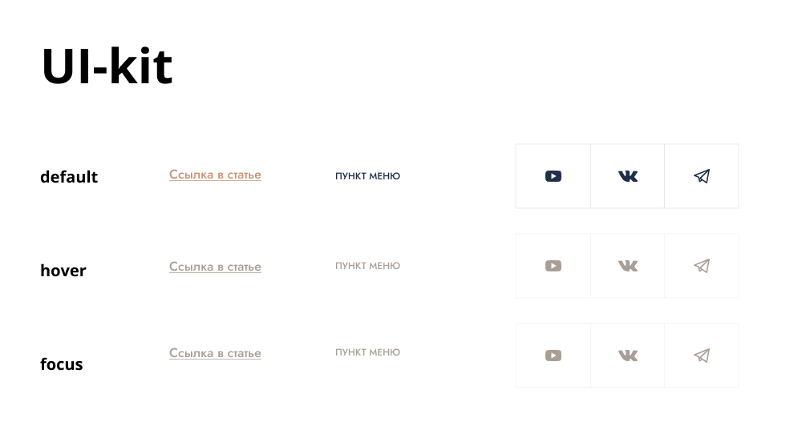
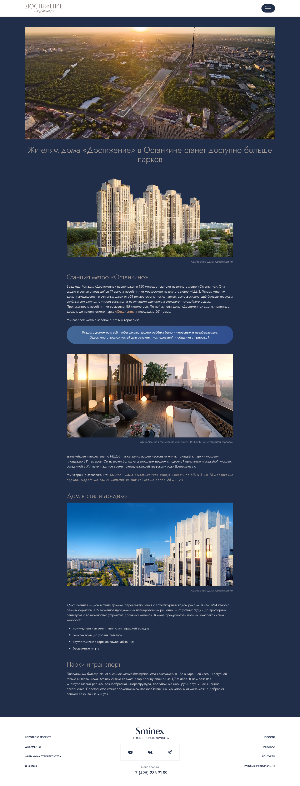
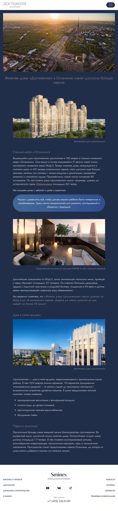
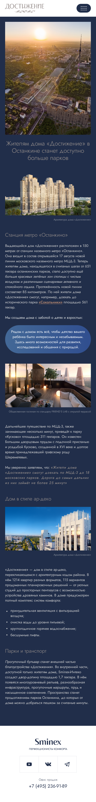

<h1 align="center">ValiNaBali </h1>
<ul>
  <li>The layout is adapted to all resolutions and confirmed in the layout.</li>
  <li>Raster images are prepared for screens with a pixel density of 2x.</li>
  <li>The images are connected taking into account their adaptation.</li>
  <li>Styling is done using the Sass preprocessor.</li>
  <li>Font families and colors are stored in SCSS variables.</li>
  <li>All states of elements from the UI-kit have been generated.</li>
  <li>If the main content is not high enough, the footer of the page is pressed to the bottom of the screen (screenshot).</li>
  <li>Form fields are inside the <form> tag.</li>
  <li>Required fields have the required attribute.
We managed to avoid excessive increase in selector weight (example of error).</li>
  <li>The area of ​​interaction with the interactive element is predictable and sufficient.</li>
  <li>Positioned graphic elements have clickability disabled (pointer-events: none;).</li>
  <li>Vector images have been added to the sprite.</li>
  <li>Form fields always have name and id attributes, and radio buttons always have value.</li>
  <li>The layout corresponds to the layout, taking into account the Pixel Perfect check (error - 10 px).</li>
  <li>Grids are designed using Flex or Grid technology.</li>
  <li>All interactive elements have an explicit or hidden text signature.</li>
  <li>Added a hidden header when there is no suitable header from the layout.</li>
  <li>The button's required type attribute is filled in correctly.</li>
  <li>The main content of the page should not be outside the section</li>
  <li>All content inside the main tag is located in <section> tags.</li>
  <li>When forming sections, horizontal alignment relative to the edges of the page is performed using the utilitarian class ”container”</li>
  <li>The layout is made in accordance with the layout.</li>
  <li>The logic of the project file structure is observed.</li>
  <li>The code is formatted.</li>
  <li>The layout was created using BEM.</li>
</ul>
<h2 align="center">Layout, UI-KIT</h2>

  

<h2 align="center">Layout, Desktop - 1440</h2>

  

<h2 align="center">Layout, Tablet - 768</h2>

  

<h2 align="center">Layout, Mobile - 375</h2>

  

